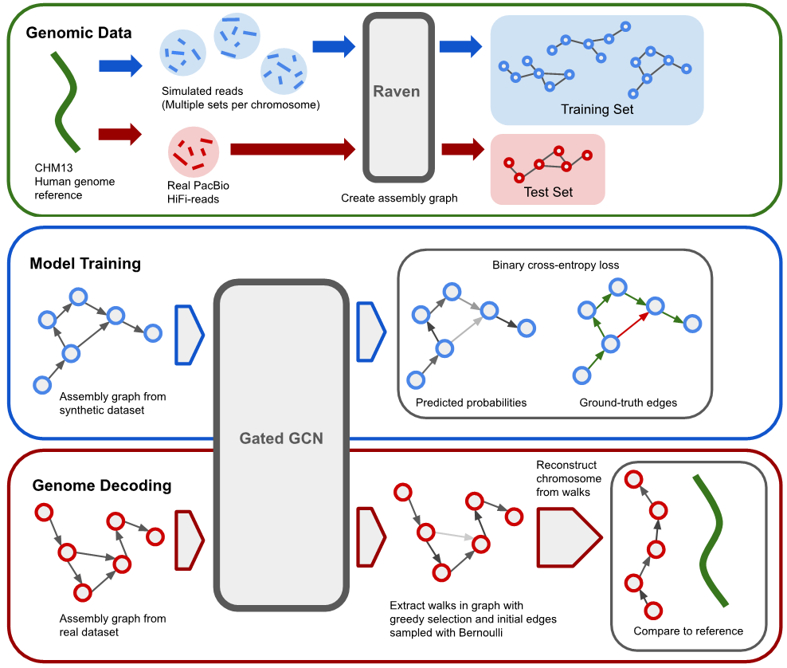

# GNNome Assembly
中文/Chinese from Ben Cao
非常漂亮的工作！

This repository contains the code for the following paper:

Lovro Vrček, Xavier Bresson, Thomas Laurent, Martin Schmitz, Mile Šikić. [Learning to Untangle Genome Assembly with Graph Convolutional Networks](https://arxiv.org/abs/2206.00668), arXiv preprint arXiv:2206.00668, 2022.

---

A framework for training graph neural networks to untangle assembly graphs obtained from de novo genome assembly.

This framework consists of simulating the synthetic reads, generating the assebmly graphs, training a Graph Neural Network to predict edge probabilities, and finally decoding these edge probabilities with greedy search. The final result are assembly sequences stored in the commonly used FASTA format.

<p align="center">
  
</p>


## Installation

### Requirements
- conda: 4.6+

### Setting up virtual environment

#### 1. Create a conda virtual environment
```bash
conda env create -f environment.yml
conda activate gnn-assembly
```

#### 2. Install the GPU-specific requirements
Use pip for both of the installations bellow.

- **PyTorch**: Install version 1.9 or higher, based on your CUDA version:
https://pytorch.org/get-started/previous-versions/#linux-and-windows-7

- **DGL**: Install version 3.8 or higher, based on your CUDA version:
https://www.dgl.ai/pages/start.html

For example, for CUDA 11.1, this could be:
```bash
pip install torch==1.9.0+cu111 torchvision==0.10.0+cu111 torchaudio==0.9.0 -f https://download.pytorch.org/whl/torch_stable.html
pip install dgl-cu111 dglgo -f https://data.dgl.ai/wheels/repo.html
```
一直到这 都没有问题，环境配置完成
## Quick start
## 这个Quick start稍微有点不那么Quick  当然因为数据集巨大 也很正常
To run a quick example, run:
```bash
python example.py
```
首先在 Download.sh 中
```
# Download chunks of the zip file
#FILE=genomic_dataset_chunk.z01
#echo -e "\nDownloading $FILE (size is 10GB)..."
#curl https://www.dropbox.com/s/fa14gza4cf9dsk3/genomic_dataset_chunk.z01?dl=1 -o genomic_dataset_chunk.z01 -J -L -k
#FILE=genomic_dataset_chunk.z02
#echo -e "\nDownloading $FILE (size is 10GB)..."
#curl https://www.dropbox.com/s/i8pftsjmbpkj1a0/genomic_dataset_chunk.z02?dl=1 -o genomic_dataset_chunk.z02 -J -L -k
#FILE=genomic_dataset_chunk.z03
#echo -e "\nDownloading $FILE (size is 10GB)..."
#curl https://www.dropbox.com/s/udlqbypizummctq/genomic_dataset_chunk.z03?dl=1 -o genomic_dataset_chunk.z03 -J -L -k
#FILE=genomic_dataset_chunk.z04
#echo -e "\nDownloading $FILE (size is 10GB)..."
#curl https://www.dropbox.com/s/2qzbswupfg90tbq/genomic_dataset_chunk.z04?dl=1 -o genomic_dataset_chunk.z04 -J -L -k
#FILE=genomic_dataset_chunk
#echo -e "\nDownloading $FILE (size is 3GB)..."
#curl https://www.dropbox.com/s/0suo9k6fhtdg4p3/genomic_dataset_chunk.zip?dl=1 -o genomic_dataset_chunk.zip -J -L -k
```
这些数据集在网络情况不佳时，特别是特殊情况下推荐手动下载，然后再进行合并解压
目录已经在原始代码中创建的很完善
`pipeline.simulate_reads`主要是seqrequester进行reads的模拟，所以需要对seqrequester进行下载和安装，涉及到Makefile文件的操作，seqrequester作者Makefile写的很严谨所以门槛稍微高点，我也和作者进行了一系列的问答，最终才安装成功，详细的QA如下： https://github.com/marbl/seqrequester/issues/6
`pipeline.generate_graphs`主要是通过Raven进行组装图的生成，Raven的安装比较顺利，如果不能完成自动化，可以按照项目中的Make进行手动
cmake记得都用su的权限
```
utility/src/system/time-v1.H: In member function ‘merylutil::system::v1::muTime& merylutil::system::v1::muTime::getTime(uint32)’:
utility/src/system/time-v1.H:86:5: error: ‘gettimeofday’ was not declared in this scope
   86 |     gettimeofday(&tp, nullptr);
      |     ^~~~~~~~~~~~
make: *** [Makefile:387：/home/bio-3090ti/Benz_code/GNNome-assembly/vendor/seqrequester/build/obj/lib/libseqrequester.a/utility/src/align/align-ksw2-driver.o] 错误 1
```
这个错误是因为没有包含 <sys/time.h> 头文件，我在`align-ksw2-driver.C`和`time-v1.H`都加了#include <sys/time.h> 然后就很顺利的安装了

并且切记在
```bash
python example.py
```
的时候一定要用su权限运行，否则无论是模拟reads还是组装图都会没有写入权限。

将pytorch移动到 cuda的时候也出了点问题，一直找不到设备，最后发现作者传参的 CUDA：3  可怜我只有一块u  最后改成了 CUDA：0 解决  完美运行


输出的部分结果
```
===> VALIDATION (all validation graphs): Epoch = 99
Loss: 0.1020, fp_rate(GT=0): 0.2905, fn_rate(GT=1): 0.0458
elapsed time: 0h 0m 1s

Epoch 00100: reducing learning rate of group 0 to 2.6352e-04.
DGL graph idx=0 info:
 Graph(num_nodes=31608, num_edges=235100,
      ndata_schemes={'read_trim_end': Scheme(shape=(), dtype=torch.int64), 'read_end': Scheme(shape=(), dtype=torch.int64), 'read_start': Scheme(shape=(), dtype=torch.int64), 'read_trim_start': Scheme(shape=(), dtype=torch.int64), 'read_idx': Scheme(shape=(), dtype=torch.int64), 'read_strand': Scheme(shape=(), dtype=torch.int64), 'read_length': Scheme(shape=(), dtype=torch.int64), 'x': Scheme(shape=(1,), dtype=torch.float32), 'in_deg': Scheme(shape=(), dtype=torch.float32), 'out_deg': Scheme(shape=(), dtype=torch.float32), 'pe': Scheme(shape=(16,), dtype=torch.float32)}
      edata_schemes={'y': Scheme(shape=(), dtype=torch.float32), 'overlap_length': Scheme(shape=(), dtype=torch.int64), 'overlap_similarity': Scheme(shape=(), dtype=torch.float32), 'prefix_length': Scheme(shape=(), dtype=torch.int64), 'e': Scheme(shape=(2,), dtype=torch.float32)})
elapsed time (loading network and data): 0h 0m 0s
==== Processing graph 0 : chr21 ====
tensor([ 4.6707,  4.0494,  4.4748,  ..., -5.0943, -3.7267, -1.3268])
tensor([1., 1., 1.,  ..., 0., 0., 1.])
elapsed time (get_scores): 0h 0m 6s
1: 222198 , 0:12902
==== METRICS for graph 0 : chr21 ====
acc=0.9403 precision=0.9515 recall=0.9848 f1=0.9679
fp_rate=0.2523 fn_rate=0.0485

elapsed time (get_candidates): 0h 0m 0s

idx_contig: 0, nb_processed_nodes: 0, nb_remaining_nodes: 31608, nb_original_nodes: 31608
elapsed time (get_candidates): 0h 0m 1s
elapsed time (get_visited): 0h 0m 0s
Chosen walk with index: 0 ; Length: 2822
[2822]
elapsed time (get_candidates): 0h 0m 0s

idx_contig: 1, nb_processed_nodes: 21948, nb_remaining_nodes: 9660, nb_original_nodes: 31608
elapsed time (get_candidates): 0h 0m 0s
elapsed time (get_visited): 0h 0m 0s
Chosen walk with index: 7 ; Length: 384
[2822, 384]
elapsed time (get_candidates): 0h 0m 0s

idx_contig: 2, nb_processed_nodes: 24676, nb_remaining_nodes: 6932, nb_original_nodes: 31608
elapsed time (get_candidates): 0h 0m 0s
elapsed time (get_visited): 0h 0m 0s
Chosen walk with index: 27 ; Length: 430
[2822, 384, 430]
elapsed time (get_candidates): 0h 0m 0s

idx_contig: 3, nb_processed_nodes: 27044, nb_remaining_nodes: 4564, nb_original_nodes: 31608
elapsed time (get_candidates): 0h 0m 0s
elapsed time (get_visited): 0h 0m 0s
Chosen walk with index: 4 ; Length: 368
[2822, 384, 430, 368]
elapsed time (get_candidates): 0h 0m 0s

idx_contig: 4, nb_processed_nodes: 28972, nb_remaining_nodes: 2636, nb_original_nodes: 31608
elapsed time (get_candidates): 0h 0m 0s
elapsed time (get_visited): 0h 0m 0s
Chosen walk with index: 1 ; Length: 272
[2822, 384, 430, 368, 272]
elapsed time (get_candidates): 0h 0m 0s

idx_contig: 5, nb_processed_nodes: 30554, nb_remaining_nodes: 1054, nb_original_nodes: 31608
elapsed time (get_candidates): 0h 0m 0s
elapsed time (get_visited): 0h 0m 0s
Chosen walk with index: 0 ; Length: 118
[2822, 384, 430, 368, 272, 118]
elapsed time (get_candidates): 0h 0m 0s

idx_contig: 6, nb_processed_nodes: 31176, nb_remaining_nodes: 432, nb_original_nodes: 31608
elapsed time (get_candidates): 0h 0m 0s
elapsed time (get_visited): 0h 0m 0s
Chosen walk with index: 0 ; Length: 29
[2822, 384, 430, 368, 272, 118, 29]
elapsed time (get_candidates): 0h 0m 0s

idx_contig: 7, nb_processed_nodes: 31336, nb_remaining_nodes: 272, nb_original_nodes: 31608
elapsed time (get_candidates): 0h 0m 0s
elapsed time (get_visited): 0h 0m 0s
Chosen walk with index: 1 ; Length: 8
elapsed time (get_walks): 0h 0m 4s
elapsed time (get_contigs): 0h 0m 0s
elapsed time (total): 0h 0m 11s
--------------------------------------------------------------------------------
Report for graph 0 in /home/bio-3090ti/Benz_code/GNNome-assembly/data/experiments/test_example
Graph created from chr21
Num contigs:	7
Longest contig:	29564535
Reconstructed:	94.922674%
N50:	29564535
NG50:	29564535
```
This will also download the CHM13 reference and set up the directory structure for simulating reads, constructing graphs and running experiments. Default location is in the `data` directory of the root directory of this project.

Apart from setting up the working directory, running the above example will simulate four read datasets for chromosome 19 and one read dataset for chromosome 21 and construct graphs from those reads. Subsequently, it will train a model on three chromosome 19 graphs, validate it on one chromosome 19 graph, and, finally, create assembly for chromosome 21. After reconstruction, the assembly sequences can be found in `data/experiments/test_example/assembly/0_assembly.fasta`.


## Download the real data

The real data is automatically downloaded by running the `example.py` script, as described above or if you run a custom run with `pipeline.py`, as described in the next section. However, you can also download the real dataset separately, by running:
```bash
bash download_dataset.sh <data_path>
```
after which the dataset will be saved in `<data_path>/real/`

**Note:** This dataset has 43 GB when compressed (during download) and 180 GB when uncompressed (used during training/evaluation).

## Reproduce the results

The results can easily be reproduced by running `reproduce.py` script, with `--mode` argument set to either `synth` for synthetic data or `real` for real data. For example:
```bash
python reproduce.py --mode real
```
will load the model pretrained on 15 chromosome 19 graphs, which is stored in `pretrained_models/model_15xchr19.pt`, and produce assembly sequences for all 23 real-data chromosomes. We suggest you evaluate the obtained assemblies with Quast, as explained at the end of this README.

## Usage

### 1. Specify the train/valid/test split
You can choose on which graphs to train, validate, and test, by editing `_train_dict`, `valid_dict`, and `_test_dict` inside `config.py`.
Inside each dictionary specify how many graphs created from which chromosome you wish to train, validate, and test on. For real data, add suffix "_r".

E.g., to train on two graphs of chromosome 19 and one graphs of chromosome 20, valdiate on one chromosome 19 graphs, and test on chromosome 21 graph created from real PacBio HiFi data, write:
```python
_train_dict = {'chr19': 2, 'chr20': 1}
_valid_dict = {'chr19': 1}
_test_dict = {'chr21_r': 1}
```
Note that all three chr19 graphs are created from different sets of reads (sampled anew each time), and thus are different themselves.
Also note that you cannot specify more than one graph per real chromosome.


### 2. [Optional] Adjust the hyperparameters

All the hyperparameters are in the `hyperparameters.py`. Change them by editing the dictionary inside the file.


### 3. Run the pipeline
```bash
python pipeline.py --data <data_path> --out <out_name>
```

Arguments:

- `--data`: (default value: `data/`) path where simulated sequences, real sequences, constructed graphs, and the experiments will be stores. 

- `--out`: (default value: timestamp at running the pipeline) name that will be used for naming the directories for train/valid/test, and saving the model and the checkpoints during the training. The models are saved inside the `pretrained` directory. E.g., with `--out example`, the model will be saved int `pretrained/model_example.pt`, and all the checkpoint information (optimizer parameters, loss, etc.) will be saved inside `checkpoints/example.pt`. In the same example, train/valid/test directories would be `<data_path>/experiments/train_example`, `<data_path>/experiments/valid_example`, `<data_path>/experiments/test_example`.

For example, if you want to save the data inside `other_dir/data` and call all the output files `example_run`, run:
```bash
python pipeline.py --data other_dir/data --out example_run
```

### 4. Evaluate assemblies
The assembly sequences, obtained for the graphs in the test set, wil lbe stored inside `<data_path>/experiments/test_<out>/assembly` directory. The easiest way to evaluate the obtained assemblies is with [Quast](https://github.com/ablab/quast). For installing Quast, we suggest creating a new conda environment (due to clashing dependencies):
```bash
conda create -n quast python=3.6
conda activate quast
conda install -c bioconda quast
```
The general usage is as follows:
```bash
quast -r <path_to_reference> -o <output_dir> <path_to_assembly_file>
```
For example, if inside `test_example` directory you only have one graph of chromosome 21, then you could evaluate the assembly sequence of that chromosome by running:
```bash
quast -r <ref_path>/chromosomes/chr21.fasta -o <data_path>/experiments/test_example/quast <data_path>/experiments/test_example/assembly/0_assembly.fasta
```
The report, containing all the evaluation metrics, will be located at `<data_path>/experiments/test_example/quast/report.txt`.


## Citation
To cite this work, please use the following:
```
@article{vrvcek2022learning,
  title={Learning to Untangle Genome Assembly with Graph Convolutional Networks},
  author={Vr{\v{c}}ek, Lovro and Bresson, Xavier and Laurent, Thomas and Schmitz, Martin and {\v{S}}iki{\'c}, Mile},
  journal={arXiv preprint arXiv:2206.00668},
  year={2022}
}
```
